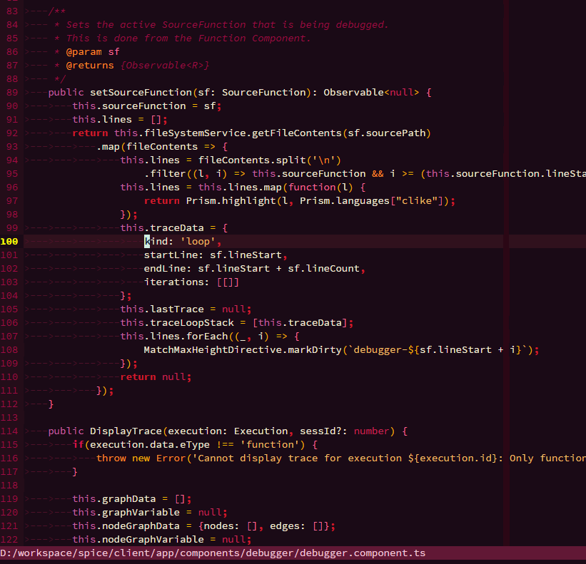
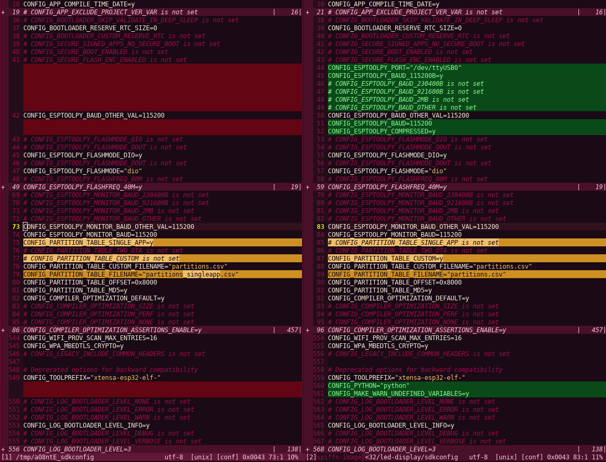

burgundy.vim
============

full bodied vim color scheme
---------------------------

burgundy is a dark color scheme for vim gui and terminal.

it is a work in progress

# Screenshots




# Installation

Insall using your favorite plugin manager. For example, using [vim-plug](https://github.com/junegunn/vim-plug):

Add to your vimrc:

```vim
Plug 'elliothatch/burgundy.vim'
```

Then run:

```vim
:PlugInstall
```

To set burgundy as your default color scheme, add to your vimrc:

```vim
set termguicolors
colorscheme burgundy
```

# Changelog
 - 2024-02-18: Add limited support for tree-sitter @markup (markdown) highlight groups
 - 2021-07-10: Support neovim LSP highlight groups
 - 2020-06-18: Tweaked diff colors and todo color, made some minor improvements to 256 color mode (`set notermguicolors`), add diff screenshot
